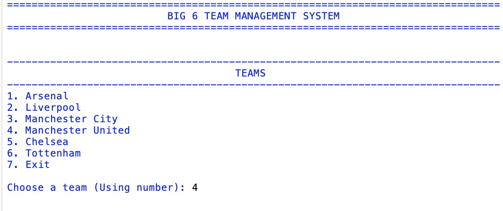
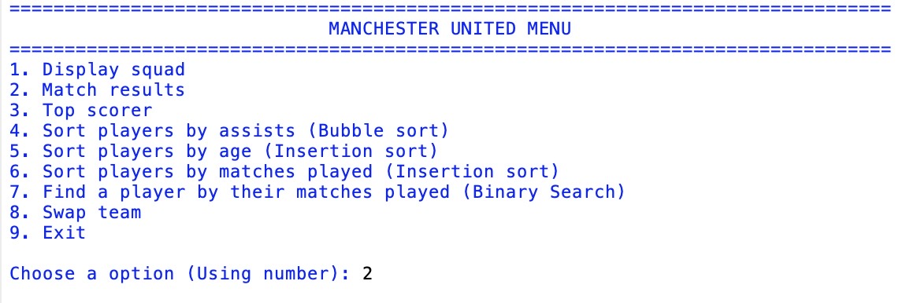
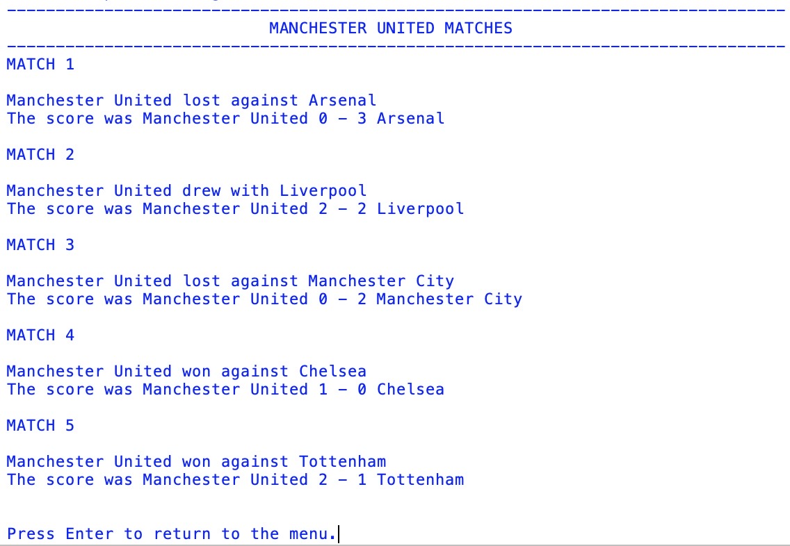
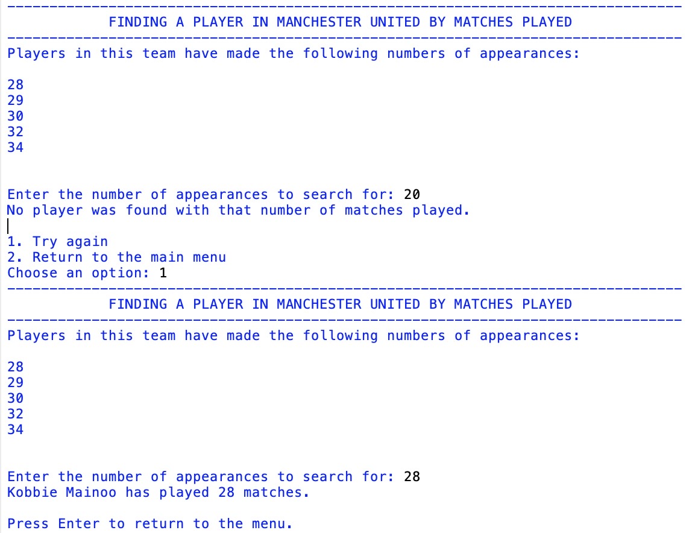

# Big 6 football management system

This is my first object-oriented programming project in Python.

I created it over the summer before starting Advanced Higher Computing Science to help me learn some of the concepts in advance. Throughout the project I practised inheritance, polymorphism, file handling, sorting algorithms and binary search while building a simple football team management system.

The program allows the user to choose one of six football teams and view information about their squad, match results and player statistics.

## Features

- Choose from six football teams
- Display each team's squad
- View match results
- Find the team's top scorer
- Sort players by assists using Bubble Sort
- Sort players by age using Insertion Sort
- Sort players by appearances using Insertion Sort
- Find a player by appearances using Binary Search
- Switch teams using a menu system

## What I learnt

This project helped me practise:

- Object-oriented programming
- Classes and objects
- Inheritance
- Polymorphism
- File handling
- Bubble Sort
- Insertion Sort
- Binary Search
- Input validation

## Files

```text
big6_team_management_system.py
arsenal.txt
liverpool.txt
man_city.txt
man_utd.txt
chelsea.txt
tottenham.txt
```
## Screenshots

###Main Menu


### Team Menu



### Squad Display



### Binary Search



## Future Improvements

- Store team data in a database instead of text files
- Add a league table
- Allow users to save changes
